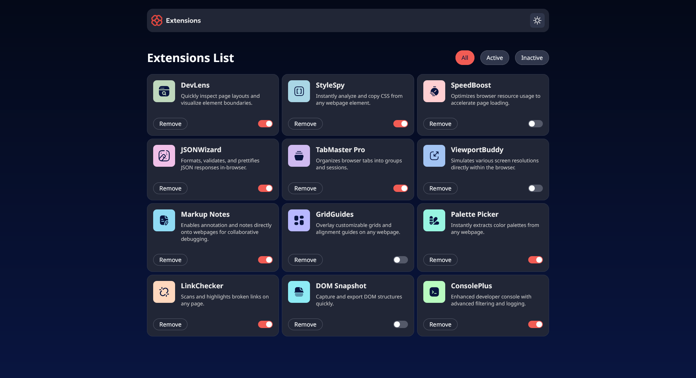

# Frontend Mentor - Browser extensions manager UI solution

This is a solution to the [Browser extensions manager UI challenge on Frontend Mentor](https://www.frontendmentor.io/challenges/browser-extension-manager-ui-yNZnOfsMAp). Frontend Mentor challenges help you improve your coding skills by building realistic projects.

## Table of contents

- [Overview](#overview)
  - [The challenge](#the-challenge)
  - [Screenshot](#screenshot)
  - [Links](#links)
- [My process](#my-process)
  - [Built with](#built-with)
  - [What I learned](#what-i-learned)
- [Author](#author)

**Note: Delete this note and update the table of contents based on what sections you keep.**

## Overview

### The challenge

Users should be able to:

- Toggle extensions between active and inactive states
- Filter active and inactive extensions
- Remove extensions from the list
- Select their color theme
- View the optimal layout for the interface depending on their device's screen size
- See hover and focus states for all interactive elements on the page

### Screenshot

### Links

- Solution URL: [GitHub](https://github.com/laerte-quinui/browser-extensions-manager-ui)
- Live Site URL: [Vercel](https://browser-extensions-manager-ui-laquinuis-projects.vercel.app/)

## My process

### Built with

- Semantic HTML5 markup
- CSS custom properties
- Flexbox
- CSS Grid
- [SVGR](https://react-svgr.com/) - To trasnform SVG into React components
- [TypeScript](https://www.typescriptlang.org/) - JavaScript with types
- [React](https://reactjs.org/) - JS library
- [Vite](https://vite.dev/) - Build tool

### What I learned

Usually I design my own projects, defining colors, typography and choosing icons all by hand, so start a project with all this things ready for use in the style-guide was really useful and fun! I could learn how other people define this stuff so I can inproove my own development.

Also, using the "vanila CSS" without relying on any style frameworks made me think more about my decisions to organizating my code, implement the theme switch feature (even though I think I didn't do it the best way), develop a good responsive experience and even style a switch button. It was really cool to realize that I still have some things to learn and improve with good old pure CSS.

## Author

- GitHub - [Laerte Quinui](https://github.com/laerte-quinui)
- Frontend Mentor - [@laerte-quinui](https://www.frontendment3or.io/profile/laerte-quinui)
